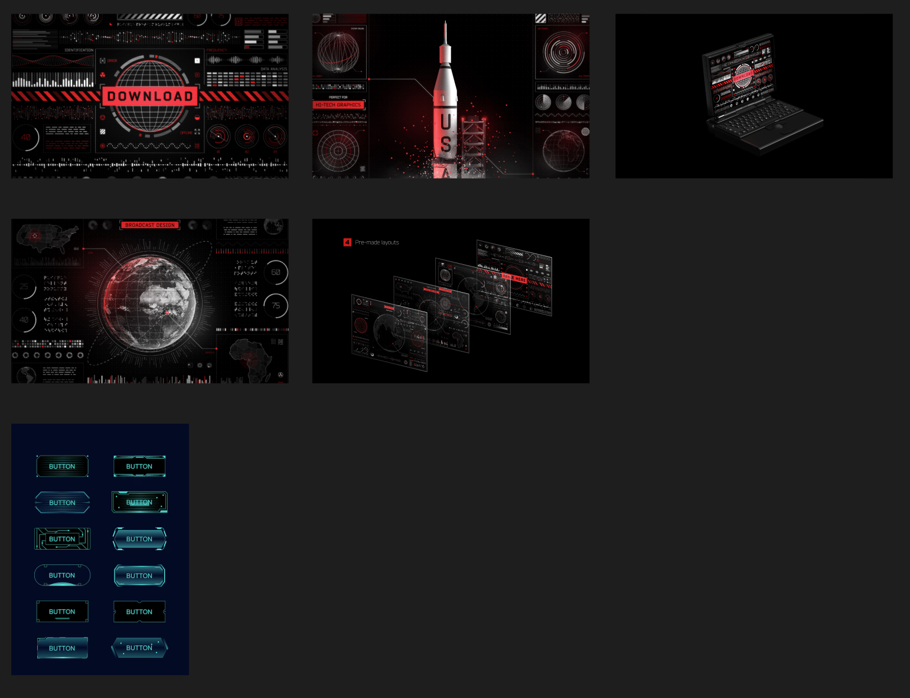
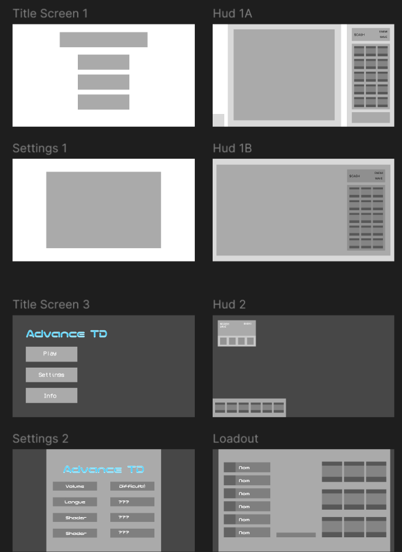

Est-ce que c'est un projet en équipe ou individuel, qui sont les membres?
Sean Larry Driesen et William Briand

Est-ce que vous allez continuer à développer et raffiner le jeu des projets antérieurs ? Si oui, quels sont les changements que vous proposez de réaliser ? Sinon, quelle est votre idée pour un nouveau jeu original ? Quels sont sa structure, ses objectifs et sa direction de présentation ?
Nouveau jeu: Advance TD, un jeu de défence de tour modulaire.

Quelle est la nouvelle fonctionnalité extra qui impacte la jouabilité (ex. high score persistant, niveau de boss, évolution du personnage, etc.)
Modularité

Que vous voulez explorer dans ce projet ?
Game states

Produire un tableau d'ambiance (moodboard)

